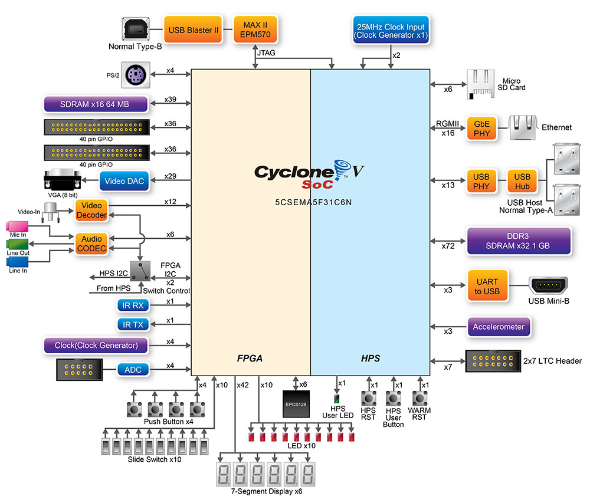

# Sadržaj
1. [Opis problema](#Zadatak)
2. [Instalacija potrebnih softverskih paketa](/docs/Uputstvo_za_instalaciju_softverskih_paketa.md)
3. [Realizacija hardverskog dijela sistema](/docs/Realizacija_hardverskog_dijela_sistema.md)</br>
  3.1.   [Kreiranje Quartus projekta](/docs/Realizacija_hardverskog_dijela_sistema.md#kreiranje-quartus-projekta)</br>
  3.2.   [Kreiranje Qsys projekta](/docs/Realizacija_hardverskog_dijela_sistema.md#kreiranje-qsys-projekta)</br>
  3.3.   [Kompajliranje dizajna](/docs/Realizacija_hardverskog_dijela_sistema.md#proces-kompajliranja-dizajna)</br>
4. [Generisanje FPGA konfiguracionog fajla](docs/Generisanje_FPGA_konfiguracionog_fajla.md)
5. [Izgradnja Linux embedded sistema](#izgradnja-embedded-linux-sistema)</br>
   5.1.   [Konfiguracija i kroskompajliranje U-Boot-a](docs/UBoot.md)</br>
   5.2.   [Konfiguracija i kroskompajliranje Linux kernela](docs/Linux.md)</br>
   5.3.   [Koristenje Buildroot alata za izgradnju Linux embedded sistema](docs/Buildroot.md)
6. [Razvoj aplikacije](#aplikacija)
  
# Zadatak
Integrisati termalnu kameru [**Meridian-MI1602**](https://www.meridianinno.com/products) na infrastrukturu [**DE1-SoC**](https://www.terasic.com.tw/cgi-bin/page/archive.pl?Language=English&No=836) platforme.
Prilagoditi sistem na **FPGA** dijelu čipa tako da se omogući povezivanje izmedju **Meridian termalne kamere** i **I2C/SPI** periferija na **HPS** dijelu, preko dostupnog *GPIO* konektora.</br>

Koristićemo **I2C**/**SPI** periferije u sklopu **HPS** dijela *CycloneV* chip-a, s tim da ćemo signalima **HPS** periferija pristupati preko **GPIO** konektora koji je, kao sto se može vidjeti na [**Slici 1**](docs/5CSEMA5F31C6_shema.jpg),
povezan na **FPGA** dio *CycloneV* chip-a. Dakle, signali HPS periferija (konkretno I2C i SPI) ce kroz *FPGA Fabric* biti povezani na pinove *GPIO konektora*.</br>

<p align="center">
  
</p>
<p align="center"><i><b>Slika 1 </b>: Šema CycloneV SoC (5CSEMA5F31C6N) </i></p>

## [Realizacija hardverskom dijela sistema](/docs/Realizacija_hardverskog_dijela_sistema.md) 💻⚙️

<p align="center">
  
</p>
<p align="center"><i><b>Slika 2 </b>: Tok izgradnje sistema </i></p>

Prvi korak ka integraciji *Meridian termalne kamere* sa *DE1-SoC* sistemom, jeste realizacija hardverskog dijela sistema.
Na **Slici 2** možemo vidjeti tok izgradnje našeg *embedded* sistema, počevši od realizacije dizajna u slokpu ***Qsys*** alata pa do *build*-anja *bootloader*-a.</br>

Kompletan vodič za kreiranje hardverskog dijela sistema u okviru **Qsys Quartus** alata dat je [ovdje](/docs/Realizacija_hardverskog_dijela_sistema.md), a u nastavku ćemo se dotaći samo najbitnijih tačaka.</br>

U okviru ***Quartus Prime Qsys*** alata, biramo sledeće komponente koje će činiti naš hardverski sistem:
1. **Clock Source** izvora takt signala od *50MHz*
2. **AlteraV/CycloneV HPS**
3. **System Peripheral ID**

<p align="center">
  
</p>
<p align="center"><i><b>Slika 3 </b>: Sematski prikaz hardverskog sistema realizovanog u okviru Qsys alata</i></p>

Potrebno je podesiti *PinMux* **HPS**-a, te je u skladu sa [šemom CycloneV SoC-a](docs/DE1-SoC_schematic.pdf) izabrana sledeća konfiguracija pinova:

|   PIN   |               Funkcije PIN-a                   |    Selektovana funkcija   |
|---------|------------------------------------------------|---------------------------|
|   C25   |   TRACE_D1/SPIS0_MOSI/**UART0_TX**/HPS_GPIO50  |       UART0_TX            |
|   B25   |   TRACE_D0/SPIS0_CLK/**UART0_RX**/HPS_GPIO49   |       UART0_RX            |
|         |                                                |                           |
|    -    |      FPGA mode Full                            |          I2C0             |
|    -    |      FPGA mode Full                            |          SPIM0            |
|         |                                                |                           |
|    -    |      HPS I/O  RGMII                            |          EMAC1            |
|    -    |      HPS I/O  4-bit Data                       |          SDIO0            |


Kako **HPS** koristi eksternu DDR3, eksportujemo **hps_0_ddr** *Conduit* za pristup toj memoriji, te koristimo sledeci [preset](presets/de1-soc-hps-ddr.qprs) za efikasnije
podesavanje parametara SDRAM-a, dok smo za pristup periferijama povezanim na HPS eksportovali **hps_0_io** *Conduit*.
<p align="center">
  
</p>
<p align="center"><i><b>Slika 4 </b>: HPS DDR3 SDRAM</i></p>

Nakon sto smo ispratili sve korake navedene u vodicu za realizaciju [hardverskod dijela sistema](/docs/Realizacija_hardverskog_dijela_sistema.md), trebalo bi da je uspjesno zavrsen proces 
kompilacije (*Processing->Start compilation*). 

Nakon kompilacije dizajna, dobicemo *output_files/name.sof*, koji cemo konvertovati u **Raw Binary File (.rbf)** za konfiguraciju **FPGA Fabric**-a tokom procesa **boot**-anja sistema. Ovaj postupak je detaljno opisan u vodicu za generisanje [**FPGA konfiguracionog fajla**](/docs/Generisanje_FPGA_konfiguracionog_fajla.md).


## Izgradnja embedded Linux sistema

Sada je potrebno da izgradimo **embedded Linux sistem**. U sklopu ovog repozitorijuma objasnjena su 2 nacina
za kompletnu izgradjnu jednog embedded sistema i to:
- [koristenjem **Buildroot**-a](/docs/Buildroot.md) (istovremeno build-amo sve dijelove sistema)
- pojedinacnom izgradnjom svakog dijela sistema

Ukoliko se odlucimo za rucno sastavljanje **Embedded Linux sistema** bez korišćenja automatizovanih **build** sistema kao što su **Buildroot**, **Yocto** i slicno, postupak je sledeci.

Da bi sistem mogao ispravno da se pokrene na **DE1-SoC** ploči sa **SD** kartice, potrebno je da obezbijedimo da organizacija particija na kartici odgovara onoj koju očekuje **BootROM** kod **CycloneV** čipa. S tim u vezi treba ispratiti uputstvo za [paritcionisanje SD kartice](/docs/Particionisanje_SD_kartice.md) kako bi ista poprimila strukturu kao sa slike ispod:

<p align="left">
  
<p>

Sada mozemo pristupiti [konfiguraciji i kros-kompajliranju U-Boot-a](docs/UBoot.md). 
Nakon sto smo kopirali bootable fajl koji objedinjuje 4 kopije SPL-a i U-Boot binarnu sliku na 0xA2 raw particiju komandom
```bash
sudo dd if=u-boot-with-spl.sfp of=/dev/sda3 bs=512
```
stavite karticu u slot na ploci, povežite UART-USB kabl sam PC računarom, podesite serijski terminal na PC-u i uključite napajanje na ploči. Na serijskom terminalu dobijamo sledeci ispis:
```bash
U-Boot 2024.01 (Jul 30 2025 - 15:52:25 +0200)

CPU:   Altera SoCFPGA Platform
FPGA:  Altera Cyclone V, SE/A5 or SX/C5 or ST/D5, version 0x0
BOOT:  SD/MMC Internal Transceiver (3.0V)
DRAM:  1 GiB
Core:  27 devices, 15 uclasses, devicetree: separate
MMC:   dwmmc0@ff704000: 0
Loading Environment from MMC... OK
In:    serial
Out:   serial
Err:   serial
Model: Terasic DE1-SoC
```

Na red dolazi konfiguracija i kroskompajliranje Linux kernela sto je detaljno objasnjeno u sklopu fajla [konfiguracija Linux kernela](docs/Linux.md)

## Aplikacija

Na **Slici 6** su prikazana dva nacina povezivanja **MI48E4 TIP Board** sa hostom. Mi cemo koristiti drugi nacin.
<p align="center">
 
</p>
<p align="center"><i><b>Slika 6 </b>: Konceptualni dijagram 2 nacina povezivanja Panthera EVK board </i></p>


Registarska mapa Meridian modula je velika, ali je za nasu demonstracione potrebe sasvim dovoljno podesiti svega 2 registra kako bismo dobili prvi frejm. 
| Registar | Adresa registra | Vrijednost | Opis |
|----------|-----------------|------------|------|
| MCU_RESET | 0X00 | 0x01 | softverski reset MI48E4 komponente |
| FRAME_MODE | 0xB1 | 0x21 | Single Frame Mode bez zaglavlja |

<p align="center">
 
</p>
<p align="center"><i><b>Slika 7 </b>: Thermal Data Frame format </i></p>


Kako smo za **FRAME_MODE** izabrali *Single Frame mode without header*, svaki temperaturni frejm se sastoji od **160x120** rijeci tj. **160x120x2** bajtova (svaka rijec je 2B). Tokom transfera prvo se prenosi bit najvece tezine (BE). Svaka rijec predstavlja temperaturu jednog piksela i predstavljena je kao 16-bit unsigned integer u jedinici 0.1K. Tako na primjer, ako primimo 16-bit rijec 0x0bc1 to ce odgovarati tepmeraturi 300.9K.

Sledeca skripta predstavlja *bare minimum* za dobijanje termalnih podataka od *Panthera EVK* koristeci *single frame capture mode with no header attached to image data* nacin rada.

```bash
#!/bin/bash

i2cset -y 0 0x40 0x00 0x01 # SW Reset
sleep 3 
i2cset -y 0 0x40 0xb1 0x21 # Single frame capture with header disabled

touch image.bin # Create image file

for i in {1..120}
do
./spidev_test -s 20000000 -D /dev/spidev1.0 -b 16 -i zeroes.bin -o image_row.bin
cat image_row.bin >> image.bin
done

```
